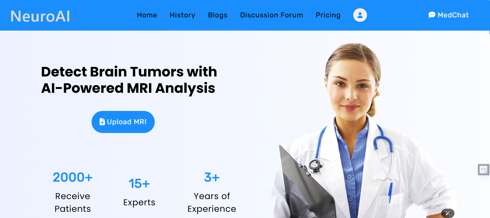

Brain Tumour Classification & Prediction Web Application

Overview

This full-stack web application integrates an advanced AI model for brain tumour classification and grade prediction from MRI scans. The platform provides highly accurate diagnostic predictions and a complete solution for clinicians and patients, incorporating features like patient history management, data security, and educational resources.

Key Features

✅ AI Model Development

Designed and trained a state-of-the-art CNN model using TensorFlow/Keras, achieving high accuracy in tumour detection and grade prediction.

✅ Seamless Integration with Web Application

Integrated the AI model into a robust Flask backend, enabling real-time inference directly through the website.

✅ History Management Module

Securely stores users’ prediction history, allowing authenticated users to review and compare past results.

✅ Patient Data Confidentiality

Ensured strict data privacy by allowing only authenticated users to access their own patient data, thereby protecting sensitive information.

✅ Educational Resources & Community Engagement

Added blogs and educational content to inform users about brain tumours, diagnosis procedures, and treatment options.

Developed a discussion forum for Q&A, fostering community support and knowledge sharing.

✅ Dynamic Pricing Module

Offers 5 free predictions per day for new users, with a subscription prompt after exceeding the limit.

Integrated subscription plans using Stripe for seamless and secure payment processing.

✅ Integrated Medical Chatbot

Deployed a Llama 3 8B medical chatbot to provide real-time assistance and answer user queries, enhancing the overall user experience.

Technologies & Tools

Deep Learning: TensorFlow/Keras (CNN-based model)

Backend Development: Flask (Python)

Frontend & UI: HTML/CSS, JavaScript (frameworks as applicable)

Payment Integration: Stripe

Chatbot Integration: Llama 3 8B

Skills Demonstrated

Machine Learning

Artificial Intelligence (AI)

React.js

Data Science

Node.js

TensorFlow

Pandas

Convolutional Neural Networks (CNN)

LLaMA

Large Language Models (LLM)

Website Building

Web Development

Pipeline Design

